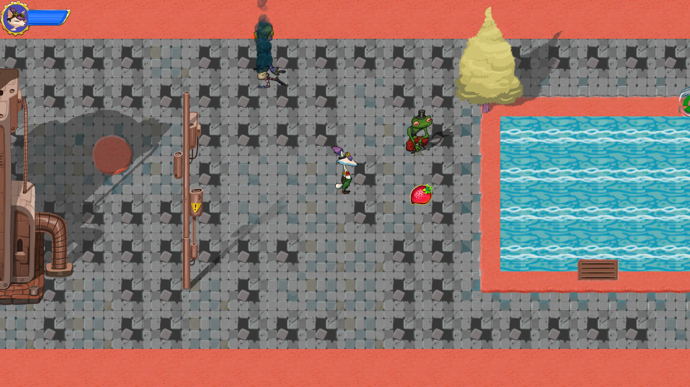
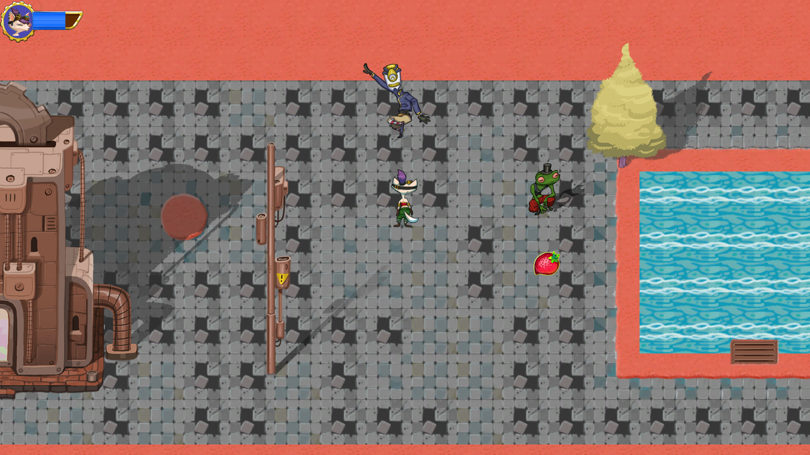

# Ruby-s-Adventure

* This game was made during the tutorial, called "Ruby's Adventure: 2D Beginner", given bu Unity, that can be found [here](https://learn.unity.com/project/ruby-s-2d-rpg). The game is a 2D game and has a top-down perspective. Since I did not make this game all alone, I owe it to myself to thank those who created and helped create the tutorial.
* This game is kinda playable. However, it still does not contain many features, such as in-game story, save system etc. My intention is to add new features as time goes on.
* Since I'm still newbie, I don't know how efficiently it was designed and/or how effectively the script codes were written.
* Last but not least, this game was build to run on Windows x86_64 architecture.

# Features
  * The ones in the game:
      * An basic-level implemented systems, that were used for weapons, movements and boss fights.
      
  * The upcoming ones:
      * Polishing current levels and adding new ones.
      * Adjusting current boss-fighting system.
      * New in-game musics and stories.
      * An instructor, that tells the way to play the game effectively.
      * Brand new levels, new bosses etc.
      * A menu state, a pause state etc.
	  
# In-game Pictures

 

# Installation

* I haven't tested the game on other computers, but following instructions should work to run the game:
	* Download the the files inside ../Buildings/ and then run the "Ruby's Adventure.exe" file folder and run the .exe file in it.
	* If you face any trouble, try downloading the .rar in the v1.0.0 release.
	
* Since I did not build this game using another Pc, I cannot direct you. However, if you download directly, then you can open it using Unity.

# Contributing
* Pull requests are welcome. For major changes, please open an issue first to discuss what you would like to change.

# License
* I'm not sure how ethic it would be, but I would like to add a license, that is [MIT](https://choosealicense.com/licenses/mit/).
